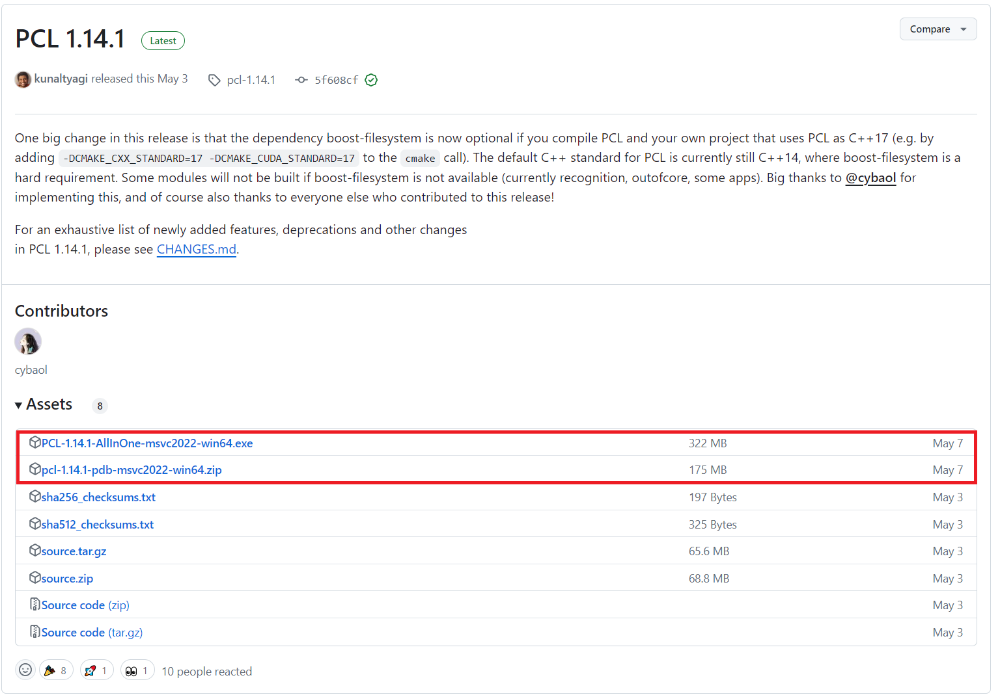

### 下载和安装 PCL 库

1. 去 [github](https://github.com/PointCloudLibrary/pcl/releases/tag/pcl-1.14.1) 下载 PCL 安装文件：一个是 *exe* 可执行文件，另一个是 *pdb* 数据库文件
    
2. 安装 *PCL-1.14.1-AllInOne-msvc2022-win64.exe*
3. 解压缩 *pcl-1.14.1-pdb-msvc2022-win64.zip* 文件，并将解压后的所有文件复制粘贴到 PCL 安装路径下的 bin 目录下
